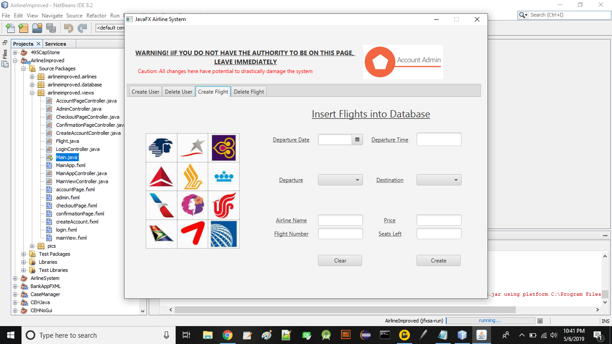
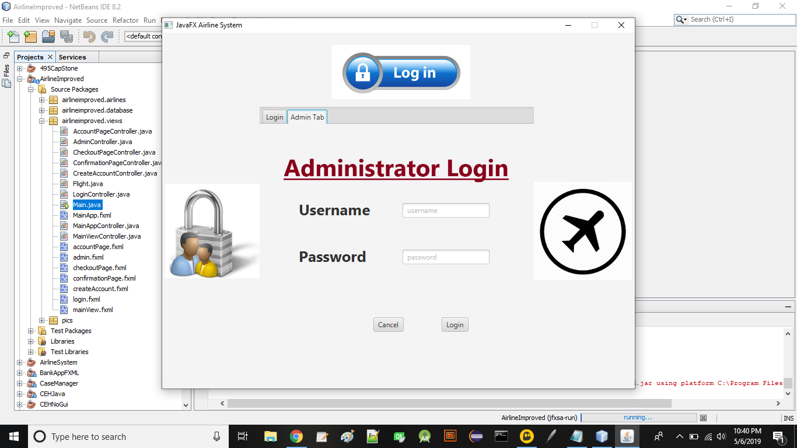
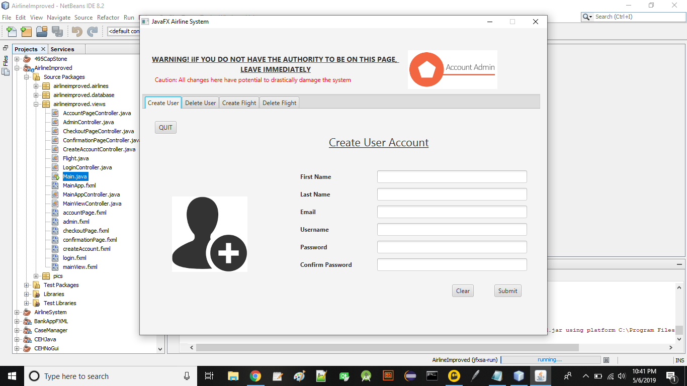
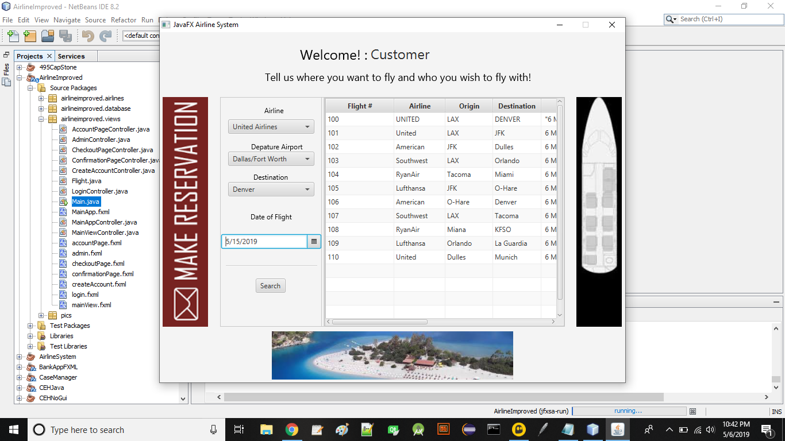
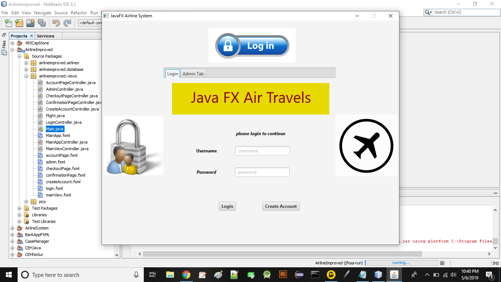

# AirlineImprovedWithDB (Still in progress)

Java FXML airline reserveration system. GUI most  

## Status
 JDBC Derby databse creation and connection with SQL. User, Airline, Flights database models and objects created for user. Preliminary data created for testing. Administrative and user login/register access portals created alongside main application for persitent acess and matintenenace. 
 
## Pending Work
Continuing of the backend and dynamic databse programming is still to come. Users will be able to select and book flights displayed in the main table popualated by  the database. The final product will be a digital ticket with customrs information.

# Screen Shots

